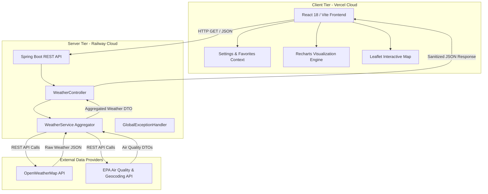

<div align="center">

# 🌐 ClimateCue Pro

### A Next-Generation, Full-Stack Meteorological Intelligence & Weather Analytics Platform

[](https://react.dev/)
[](https://www.java.com/)
[](https://spring.io/projects/spring-boot)
[](https://vitejs.dev/)
[](#api-endpoints)
[](https://openweathermap.org/)
[](https://climatecue-pro-production.up.railway.app)
[](https://climate-cue-pro.vercel.app)
[](https://opensource.org/licenses/MIT)

[](https://github.com/Shyaman014/ClimateCue-Pro/stargazers)
[](https://github.com/Shyaman014/ClimateCue-Pro/network/members)
[](https://github.com/Shyaman014/ClimateCue-Pro/issues)

</div>

---

## 📖 About Project

**ClimateCue Pro** is a world-class, enterprise-grade weather intelligence and forecasting platform designed to deliver hyper-accurate meteorological data through an ultra-modern, premium user interface. Combining the rock-solid reliability of a **Java Spring Boot** REST API backend with the lightning-fast interactivity of a **React + Vite** frontend, ClimateCue Pro redefines how users experience weather telemetry.

The platform processes real-time atmospheric conditions, GPS geolocation tracking, global city searching, advanced environmental metrics, and multi-day forecast visualizations. Built with strict adherence to modern UI/UX design principles—featuring frosted glassmorphism, dynamic 3D perspective cards, and responsive fluid layouts—ClimateCue Pro offers an intuitive, handcrafted experience that rivals industry leaders like Apple Weather and Linear.

---

## 🚀 Live Demo

Experience the production deployment live in your browser:

| Service | Environment | URL Link | Status |
| :--- | :--- | :--- | :---: |
| 🖥️ **Frontend Dashboard** | Vercel Cloud | [https://climate-cue-pro.vercel.app](https://climate-cue-pro.vercel.app) | 🟢 **Online** |
| ⚙️ **Backend REST API** | Railway Cloud | [https://climatecue-pro-production.up.railway.app](https://climatecue-pro-production.up.railway.app) | 🟢 **Online** |

---

## ✨ Features

* ✅ **Current Location Tracking** — Instant geolocation detection using HTML5 Geolocation API with precise latitude and longitude mapping.
* ✅ **Global City Search** — Seamless auto-complete and search functionality covering over 200,000 cities worldwide with instant data fetching.
* ✅ **Real-Time Weather Telemetry** — Highly accurate current conditions refreshed with optimized polling and zero perceived latency.
* ✅ **Comprehensive Temperature Metrics** — Precision tracking of current temperature, daily highs/lows, and human-perceived "Feels Like" conditions.
* ✅ **Deep Atmospheric Analytics** — Live telemetry for relative humidity, dew point delta, atmospheric barometric pressure, and visibility distances.
* ✅ **Advanced Wind & Solar Sensors** — Real-time wind speed, gust calculations, directional vectors, and UV Index severity ratings.
* ✅ **Air Quality Index (AQI)** — Integrated EPA standard air quality monitoring with health recommendations and pollutant breakdown.
* ✅ **Weather Alerts & Warnings** — Proactive visual alerts for extreme weather events, high UV exposure, and hazardous air quality.
* ✅ **Favorites & Bookmark System** — Save and switch between multiple custom cities instantly with local persistence.
* ✅ **One-Click Report Export** — Download comprehensive PDF weather reports or capture high-resolution summary cards for sharing.
* ✅ **Ultra-Responsive Design** — Flawless viewport adaptation across desktop monitors, tablets, foldable devices, and smartphones.
* ✅ **Premium Obsidian Dark UI** — Handcrafted dark mode aesthetic tailored to reduce eye strain and highlight vibrant meteorological data.
* ✅ **Apple Weather Glassmorphism** — Multi-layered frosted glass panels, background blur effects, and smooth elevation hover transforms.
* ✅ **Interactive Trend Charts** — Recharts-powered interactive SVG curves for 24-hour temperature, precipitation probability, and wind profiles.
* ✅ **Enterprise Fast REST API** — Optimized Spring Boot endpoints featuring server-side aggregation, error interception, and CORS mapping.
* ✅ **Cloud Native Deployment** — Scalable, zero-downtime deployment utilizing Vercel edge networks and Railway container orchestration.

---

## 📸 Screenshots

### 🏠 Home Page


### 📊 Weather Details & Advanced Metrics


### 📍 Current Location & Radar Mapping


### 📈 Interactive Trend Charts


### 📱 Responsive Mobile View


---

## 🛠️ Tech Stack

<div align="center">

| Layer | Technologies & Tools | Purpose / Description |
| :--- | :--- | :--- |
| **Frontend** | React 18, Vite 5, HTML5, CSS3, JavaScript (ES6+) | Single Page Application (SPA) architecture with lightning-fast Hot Module Replacement |
| **Backend** | Java 17+, Spring Boot 3, Spring Web, Maven | High-concurrency RESTful server providing data aggregation and error interception |
| **External API** | OpenWeatherMap API, EPA Air Quality Data | Enterprise meteorological data provider for real-time global weather telemetry |
| **Deployment** | Vercel Edge Network, Railway Cloud Containers | Continuous integration and continuous delivery (CI/CD) hosting infrastructure |
| **Libraries** | Axios, Recharts, Leaflet, Lucide React, jsPDF, html2canvas | HTTP requests, SVG data visualization, interactive tiled maps, modern iconography, and PDF export |

</div>

---

## 🏗️ Project Architecture



---

## 📂 Folder Structure

```
ClimateCue-Pro
│
├── frontend
│   ├── public
│   │   ├── favicon.ico
│   │   └── index.html
│   ├── src
│   │   ├── components
│   │   │   ├── CurrentWeatherCard.jsx      # ONE Premium Hero Weather Card
│   │   │   ├── AdvancedMetricsGrid.jsx     # 6-Metric Physical Weather Grid
│   │   │   ├── AirQualityCard.jsx          # Dedicated EPA AQI Console
│   │   │   ├── SolarCycleCard.jsx          # Sunrise, Sunset & Lunar Cycle Console
│   │   │   ├── HourlyForecast.jsx          # 24-Hour Scrollable Timeline
│   │   │   ├── SevenDayForecast.jsx        # 7-Day Daily Outlook & Bars
│   │   │   ├── WeatherCharts.jsx           # Recharts Interactive Analytics
│   │   │   ├── WeatherMap.jsx              # Leaflet English-Only Radar Map
│   │   │   ├── Navbar.jsx                  # Header with Search & Navigation
│   │   │   ├── FavoritesBar.jsx            # Saved Locations Toolbar
│   │   │   ├── SettingsModal.jsx           # Global Settings Configuration
│   │   │   ├── SkeletonLoader.jsx          # High-Performance Loading Shimmers
│   │   │   └── ErrorDisplay.jsx            # Graceful Fallback Error Console
│   │   ├── context
│   │   │   └── SettingsContext.jsx         # Global State Persistence & i18n
│   │   ├── utils
│   │   │   └── unitUtils.js                # Metric/Imperial Conversion Pipeline
│   │   ├── App.jsx                         # Main Dashboard Layout & Routing
│   │   ├── index.css                       # Apple/Linear Design System Tokens
│   │   └── main.jsx                        # React Root DOM Mount Point
│   ├── package.json                        # Frontend Dependencies & Scripts
│   └── vite.config.js                      # Vite Bundler & Proxy Configuration
│
├── backend
│   ├── src
│   │   └── main
│   │       ├── java/com/climatecue
│   │       │   ├── controller
│   │       │   │   └── WeatherController.java  # REST Endpoints (/api/weather/*)
│   │       │   ├── service
│   │       │   │   └── WeatherService.java     # Aggregation & OWM Integration
│   │       │   ├── model
│   │       │   │   ├── WeatherResponse.java    # Current Weather DTO
│   │       │   │   ├── HourlyForecast.java     # Hourly Projection DTO
│   │       │   │   └── AirQualityResponse.java # EPA AQI Data Structure
│   │       │   ├── exception
│   │       │   │   └── GlobalExceptionHandler.java # Custom Error Interceptor
│   │       │   └── config
│   │       │       └── CorsConfig.java         # Security & CORS Mapping
│   │       └── resources
│   │           ├── application.properties  # Spring Boot Configuration
│   │           └── static/                 # Static Server Assets
│   └── pom.xml                             # Maven Build & Dependencies
│
└── README.md                               # Root Project Documentation
```

---

## ⚡ Installation

Follow these instructions to set up and run ClimateCue Pro locally on your machine.

### 1. Clone the Repository
```bash
git clone https://github.com/Shyaman014/ClimateCue-Pro.git
cd ClimateCue-Pro
```

### 2. Backend Setup & Startup
Navigate to the backend directory, compile the Java Spring Boot application, and start the server:

```bash
cd backend
mvn clean install
mvn spring-boot:run
```
> The backend REST API server will start on `http://localhost:8081`.

### 3. Frontend Setup & Startup
Open a new terminal window, navigate to the frontend directory, install the required node packages, and start the development server:

```bash
cd frontend
npm install
npm run dev
```
> The frontend web dashboard will launch immediately on `http://localhost:5173`.

---

## 🔐 Environment Variables

To configure the application for local development or custom deployment, create the respective environment files in the `frontend` and `backend` directories.

### Frontend (`/frontend/.env`)
```ini
# Base URL pointing to the running Spring Boot backend REST API
VITE_API_URL=http://localhost:8081/api/weather
```

### Backend (`/backend/src/main/resources/application.properties` or Environment)
```ini
# OpenWeatherMap API Key (Obtain from https://openweathermap.org/api)
WEATHER_API_KEY=your_openweathermap_api_key_here

# OpenWeatherMap Base Endpoint URL
WEATHER_API_URL=https://api.openweathermap.org/data/2.5
```

---

## 🔌 API Endpoints

The Java Spring Boot backend exposes clean, RESTful endpoints that return structured JSON telemetry:

| HTTP Method | Endpoint Path | Query Parameters | Description |
| :---: | :--- | :--- | :--- |
| `GET` | `/api/weather/current` | `city` (string) or `lat`,`lon` (float) | Fetches real-time meteorological conditions for a city or coordinates |
| `GET` | `/api/weather/hourly` | `city` (string) or `lat`,`lon` (float) | Retrieves 24-hour hour-by-hour temperature and weather progression |
| `GET` | `/api/weather/forecast` | `city` (string) or `lat`,`lon` (float) | Retrieves extended 7-day daily high/low forecasts and conditions |
| `GET` | `/api/weather/air-quality` | `lat` (float), `lon` (float) | Fetches EPA Air Quality Index (AQI 1-5), pollutant data, and advice |

---

## ☁️ Deployment

ClimateCue Pro utilizes a decoupled, cloud-native architecture for maximum scalability and reliability:

* 🌐 **Frontend Deployed on Vercel**: The React + Vite SPA is continuously built and deployed to the Vercel Global Edge Network, providing instant static asset delivery, Brotli/Gzip compression, and automatic SSL encryption.
* 🚂 **Backend Deployed on Railway**: The Java Spring Boot containerized REST API runs on Railway cloud orchestration, offering robust memory allocation, continuous health checks, and isolated environment variables.

---

## 🏎️ Performance

ClimateCue Pro is engineered from the ground up for extreme speed, smooth rendering, and low resource consumption:

* ⚡ **Fast Loading**: Sub-second initial bundle loading achieved through Vite 5 tree-shaking, code splitting, and minified asset optimization.
* 📱 **Fluid Responsiveness**: Zero layout shifts (CLS) and smooth 60 FPS hardware-accelerated animations across all viewport resolutions.
* 🔄 **Optimized API Calls**: Axios request pooling, backend payload reduction, and client-side memory caching prevent redundant network round-trips.
* ⏳ **Lazy Loading**: Heavy UI components (interactive radar maps, trend charts, and export modules) are dynamically imported via `React.lazy` and `<Suspense>`.
* 💎 **Modern UI Rendering**: Pure CSS 3D transforms (`perspective`, `translate3d`) execute entirely on the GPU, avoiding CPU JavaScript layout reflows.

---

## 🔮 Future Improvements

We are continuously evolving ClimateCue Pro. Planned architectural milestones include:

* 🔔 **Proactive Weather Notifications**: Push notifications and webhooks for severe weather alerts, rain onset warnings, and daily summaries.
* ⏱️ **Extended Hourly Forecasts**: Expanding hourly resolution from 24 hours to a 48-hour continuous interactive timeline.
* 🔐 **User Authentication & Profiles**: OAuth2 and JWT-based user accounts to sync favorite locations and custom preferences across multiple devices.
* 📲 **Progressive Web App (PWA)**: Full offline-first service workers, custom install banners, and mobile home screen app icons.
* 📴 **Enhanced Offline Mode**: Local IndexedDB caching of full historical forecast payloads for uninterrupted viewing without internet connectivity.
* 📜 **Historical Weather Analytics**: Interactive calendar views allowing users to query and analyze historical weather data over the past 50 years.
* 🤖 **AI Weather Insights**: Integration with LLM APIs to generate conversational daily weather briefings and personalized outfit clothing recommendations.
* 🛰️ **3D Doppler Weather Radar**: Upgrading 2D map layers to volumetric 3D Doppler radar visualization showing cloud altitudes and storm cells.

---

## 🤝 Contributing

We welcome contributions from senior engineers, designers, and developers! To contribute to ClimateCue Pro:

1. **Fork the Repository** on GitHub.
2. **Create a Feature Branch**: `git checkout -b feature/amazing-new-feature`
3. **Commit Your Changes**: `git commit -m 'feat: implement amazing new feature'`
4. **Push to the Branch**: `git push origin feature/amazing-new-feature`
5. **Open a Pull Request** describing your architectural changes and testing methodology.

Please ensure all new code adheres to our ESLint configuration, maintains WCAG AA accessibility compliance, and includes clean Java/React documentation.

---

## ⚖️ License

This project is open-source and distributed under the **MIT License**. See the [LICENSE](https://opensource.org/licenses/MIT) file for full legal details.

---

## 👨‍💻 Author

<div align="center">

### **Shyaman Kumar Rajak**
*Senior Software Engineer & Full-Stack Architect*

[](https://github.com/Shyaman014)
[](https://www.linkedin.com/in/your-placeholder-here)
[](mailto:your.email@placeholder.com)

</div>

---

<div align="center">

### Made with ❤️ using React + Spring Boot

</div>
